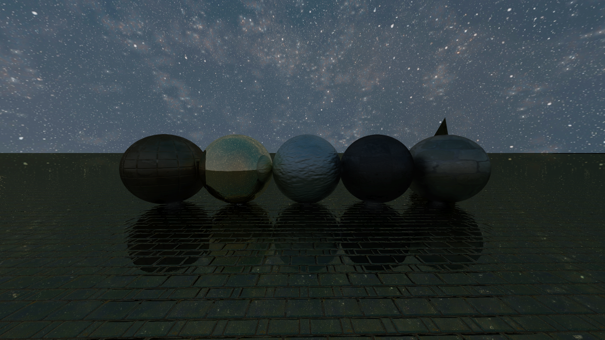

# Ray Tracing Project

### Getting Started

1. Clone repository `git clone https://github.com/andrewchik0/raytracing.git`
2. Build via CMake
3. **CLion**:
   - Set working directory in **Run | Edit Configurations**
4. **VS Code**:
   - Add this in `.vscode/launch.json` 
   ```json
   "cwd": "${workspaceFolder}"
   ```
5. Run `ray-tracing` target



### Troubleshooting

- Depending on the compiler, `STB_IMAGE_IMPLEMENTATION` may conflict with SMFL's implementation. If so, navigate to  `third_party/stb/stb_image_wrapper.cpp` and remove the `#define STB_IMAGE_IMPLEMENTATION` preprocessor define
- If CMake fails to load the project due to a version compatibility error, use `CMake 3.28.3`