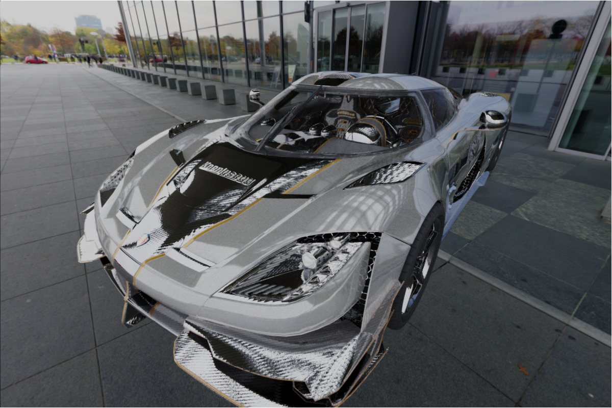
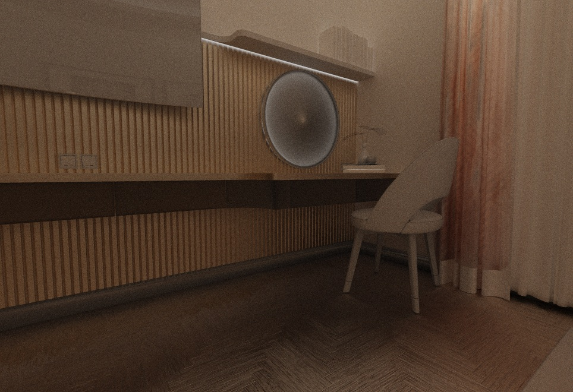
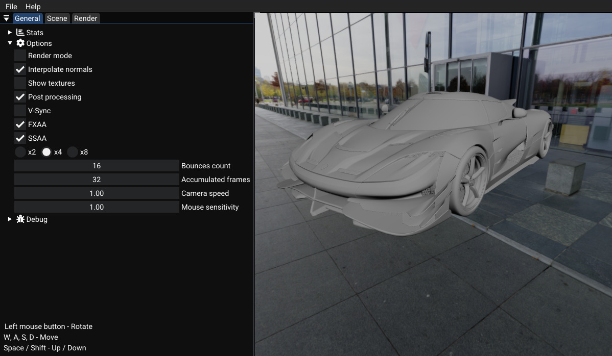
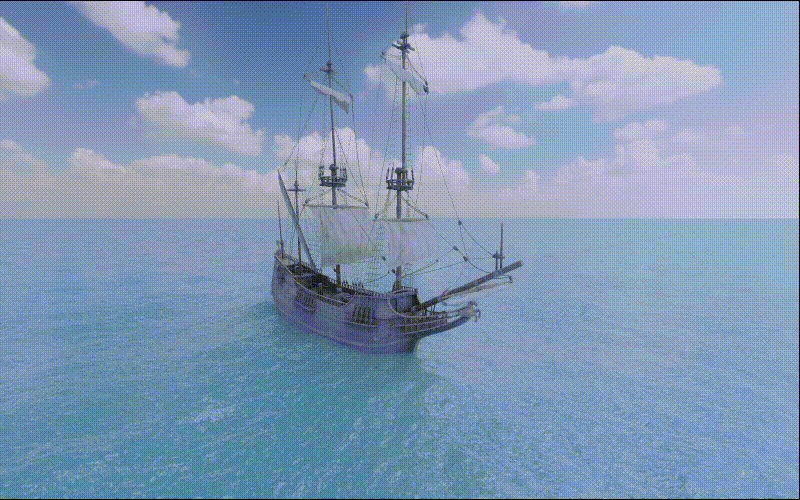
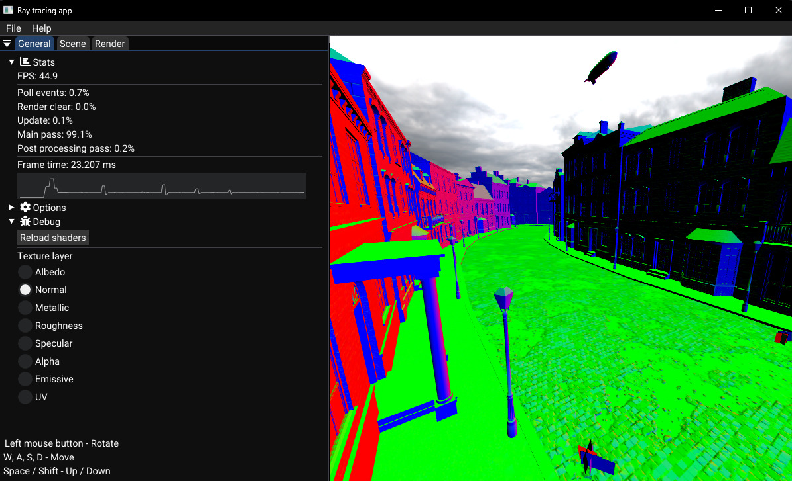

# Ray tracing rendering engine

## Building a project

1. Clone the repository `git clone https://github.com/andrewchik0/raytracing.git`
2. Build with **CMake**
3. **CLion**:
   - Set working directory to `$PROJECT_DIR$` in **Run | Edit Configurations**
4. **VS Code**:
   - Add this to `.vscode/launch.json` 
   ```json
   "cwd": "${workspaceFolder}"
   ```
5. Run `ray-tracing` target

## Render example



## Features

### Real-Time Preview & Editing
- Viewport preview
- Real-time scene editing – modify objects and materials<br>
  

### Camera options
- Exposure & Gamma
- Field of view
- Bloom intensity 

### Customizable water rendering


### Save & Load
- Save and load scenes in YAML format
```yaml
exposure: 5.96000004
gamma: 0.860000014
sky_filename: assets/skies/sky.hdr
camera:
  position: [1.75998688, 0.858130753, 2.13128805]
  direction: [-0.649915993, -0.377010763, -0.659903109]
  fov: 90
```

### Viewport options
- Anti-aliasing algorithms - FXAA or SSAA
- Normal interpolation – toggle smooth shading
- Texture Layer Viewing - inspect different material maps individually<br>


### High-Quality Image/Video Output
- Render an image using the `Render` tab for high-quality image output
- For video rendering check out [scripts](scripts/) folder and a [guide](scripts/readme.md)
