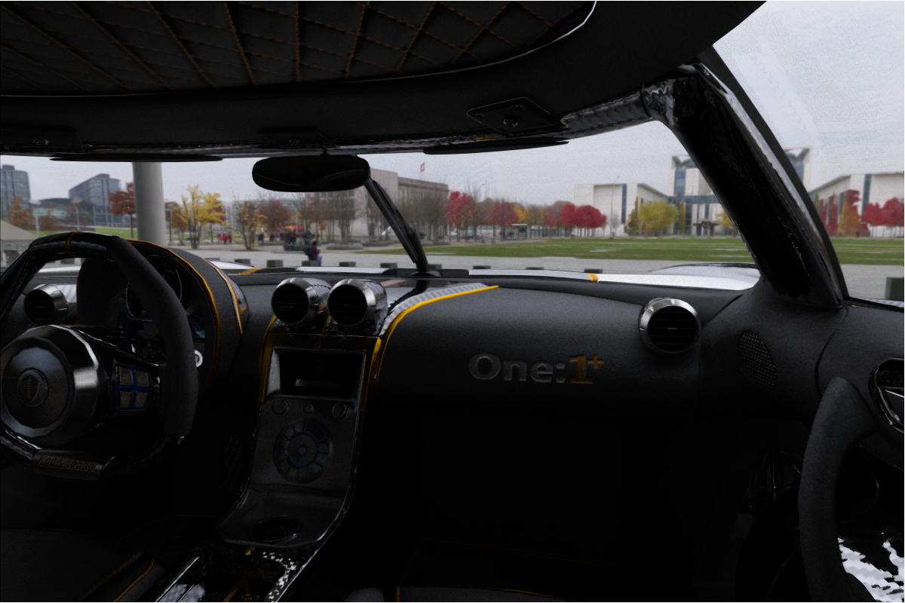

# Ray tracing rendering engine

### Getting Started

1. Clone repository `git clone https://github.com/andrewchik0/raytracing.git`
2. Build via CMake
3. **CLion**:
   - Set working directory to `$PROJECT_DIR$` in **Run | Edit Configurations**
4. **VS Code**:
   - Add this in `.vscode/launch.json` 
   ```json
   "cwd": "${workspaceFolder}"
   ```
5. Run `ray-tracing` target


